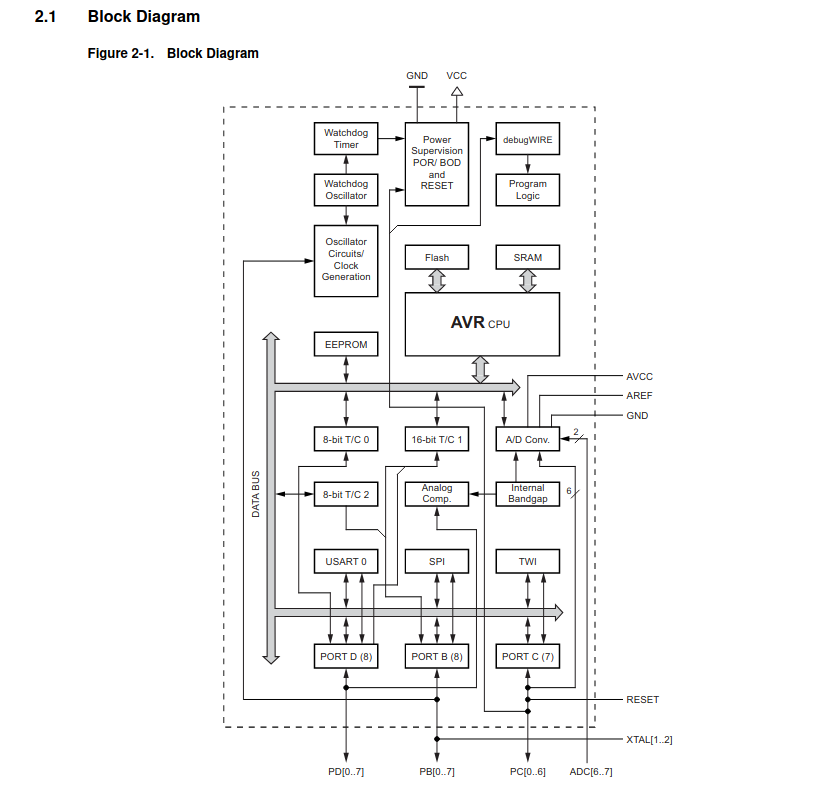
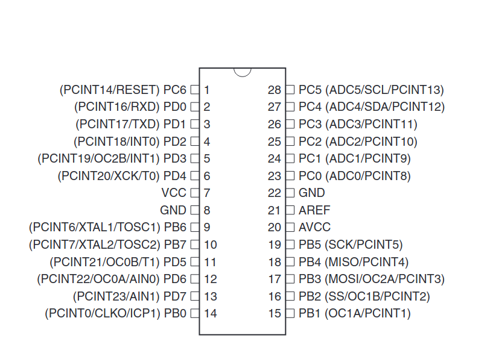
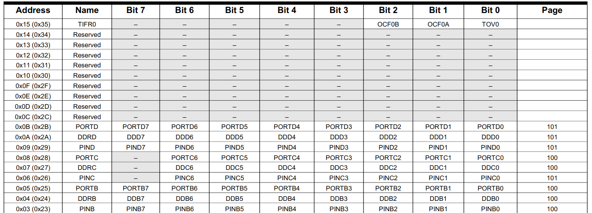
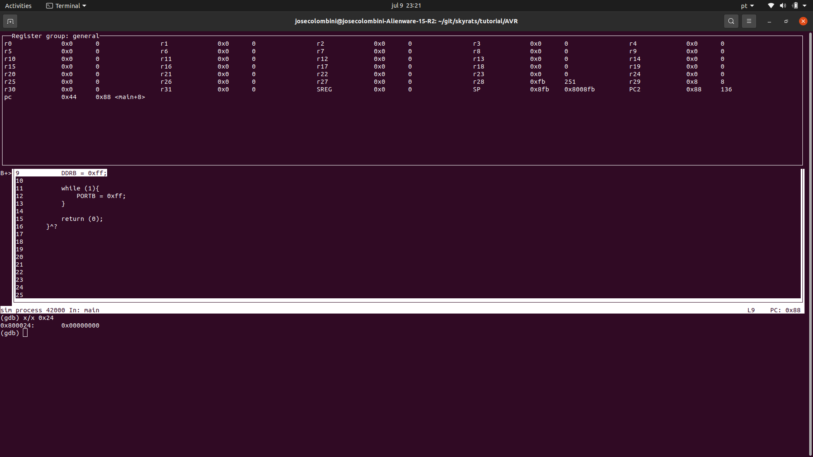
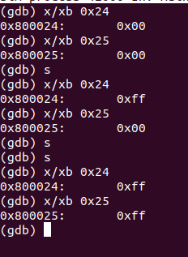

# Tutorial C para MCU - Capitulo 1

Neste tutorial utilizaremos a arquitetura AVR, as justificativas para tal são:

- Ele possui todo o ferramental disponibilizado pela Atmel em open source pelo GCC/GDB (diferente da arquietetura PIC);
- Caso você queira relizar uma implementação real você encontrará um chip Atmel em qualquer lugar e barato, visto que eles são utilizados nas placas Arduino;
- Se desejar aprender usando um Arduino sinta-se avontade, a ideia de utilizar o avr-libc para programar é para um questão didatica de manter você o mais próximo do hardware, o que acontece na maioria dos casos de programação de MCU. Raros casos você encontrará uma plataforma de programação amigável como o Arduino, pois ela não são tão otimizadas.

A arquitutura AVR é basesada no RISC de Harvard e sua definição é disponibilizada pela Atmel (Microchip atual proprietária). Eventualmente posso publicar algo mais especifico sobre estas arquiteturas.

Para este tutorial, que visa a familiarização com a parte técnica da programação em C em baixissimo nível de abstração, será apresentado o passo a passo mais técnico, abordando superficialmente as teorías relacionadas.

Para este Tutorial recomenda-se ja saber:


O documento a seguir esta organizado em:
- [Instalação](#Instalação)
- Ligar um LED
    - Registradores
- avr-gcc
    - Assembly
    - Executável
- Exercícios

# Instalação

Para fazer o dowload do ferramental utilizado aqui você pode seguir o tutorial presente no: [original documentation of avr lib](1). Ou usar os seguintes comandos.

```bash
sudo apt update
sudo apt install binutils-avr
sudo apt install gcc-avr
sudo apt install avr-libc
sudo apt install gdb-avr
```

Depois deste itens instalados estamos com um ambiente pronto para fazer cross compile de códigos para arquitetura AVR e realizar uma simulação com o gdb, caso queira fazer o upload para um chip será necessário outros pacotes

# LED On

Para entendermos como programar um Atmega vamos usar como exemplo um código simples e usaremos engenharia reversa para entender um pouco mais.

```C
#ifndef F_CPU
#define F_CPU 1000000UL
#endif
#include <avr/io.h>    


int main(void){

    DDRB = 0xff;

    while (1){
        PORTB = 0xff;
    }
    
    return (0);
}
```

Este código simples ajuda a entender bastante a proximidade que devemos ter a placa para conseguir fazer o código funcionar.

Inicialmente fazermos uma definição do clock do MCU:

```C
#ifndef F_CPU
#define F_CPU 1000000UL
#endif
```

[Incluimos a biblioteca do avr, descrita na documentação original](2)

Finalmente definimos a main. Nela são realizadas as seguintes atividades:
 - inserção de 0xff em DDRB
 - inserção de 0xff em PORTB

```C
    DDRB = 0xff;

    while (1){
        PORTB = 0xff;
    }  
```

Para entendermos estes comandos vamos explorar um pouco a arquitetura AVR e seus registradores

## Um pouco da arquitetura AVR

Como exemplo o chip do popular ATmega328P, cuja o diagrama de blocos e o encapsulamento, retirados de datasheets da atmel estão apresentados a seguir ([datasheet 1](3) [datasheet 2](4)).






Podemos ver através das figuras que o PORTB e o DDRB tem uma relação bem ínitima com o pinout do chip, mas como eles se relacionam?

Estes nomes **PORTx** e **DDRx** são os nomes dados para os registradores relacionados aos pinos **Px**, onde x pertence a [A, B, C, D]. Cada agrumento de pinos tem suas particularidades, que não convém apresentá-las a fundo agora, porém convém entender um pouco mais sobre os registradores, apresentados nesta figura.



A arquitetura AVR usada neste chuip é um arquitetura 8 bits,e de forma condizente os registradores são de 8 bits. Também é interessante observar que estes registradores estão mapeados no endereço de memória (0x25 para o PORTB).

O **DDRx** é o registrador responsável por dizer se um pino esta funcionando com input ou output. Cada pino (0, 1, 2...) esta associado a um bit do registrador (bits DDB0, DDB1...), e tem sua função setada como input quando seu bit é 0 e output 1.

Já o **PORTx** define o modo de operação do pino, para o modo de input o **PORTx** define: (0) modo de operação normal, e (1) pull-up. Por outro lado, quando o pino esta definido como output o valor colocado no respectivo bit é colocado no pino como saida, ou seja, se o bit PORTB3 = 1, o pino PB3 terá valor 1 como saída (tipicamente 5V), se ele estiver com 0 a saida será 0.

Portanto em nosso exemplo colocamos o todo os pinos PB em modo output e colocamos seus valores lógicos em 1. Se o devido circuito elétrico for montado você conseguirá acender 8 LEDs.

# avr-gcc

Agora chegou a parte divertida, iremos executar nosso código.

O avr-gcc é um cross compilador que abrange um ampla gama de chips, portanto sempre é necessário definir o chip. Além disso, aqui colocaremos uma flag para o debbuger para permitir que possamos ler usar o gdb de forma mais tranquila.

```bash
 avr-gcc -mmcu=atmega328 -W -g led.c -o led.out
```

-W e -g passam parametros para o gdb,"led.c" é o nome do arquivo que desejamos compilar. A flag -o permite você definir o nome do objeto gerado, caso n apresentado é gerado um arquivo a.out.

A flag "-mmcu=" é usada para definir o chip que vamos compilar, neste caso o atmege328.

## Assembly

```bash
 avr-gcc -mmcu=atmega328 -S led.c -o led.s
```

Este comando vai produzir um arquivo em linguagem assembly, fica a cargo do leitor ler ele para ter uma ideia de como é gerado código objeto. Para entender um pouco melhor consulte a [ISA do AVR](5)

## Executável

Para executar o código no gdb para podermos ver o esta acontecendo execute

```bash
avr-gdb led.out
```

Ao abrir o gdb vocẽ precisará definir como simulação e carrear o código no simulador. Coloque um break point no main e de um run.

```bash
(gdb) target sim
(gdb) load
(gdb) b main
(gdb) r
```
Agora aperte "ctrl+x" e depois 2, desta forma vai aparecer a tabela de registradores de propósito geral e o código (apertar varias vezes essa combinação de botões para apresentar diferentes telas)



Agora com esta tela em visível vamos utilizar o comando para verificar o que esta no registrador DDRB e PORTB. Como eles são de apenas 1 byte (2 hexadecimais). Vamos ve-los com o seguintes comando x/xb [endereço], que permite ver o em hexadecimal o byte do endereço escolhido.

Para executar um passo use o comando step (s) e para executar a linha marcada.

Se dermos a seguinte lista de comandos teremos o resultado apresentado na figura a seguir

```
(gdb) x/xb 0x24
(gdb) x/xb 0x25
(gdb) s
(gdb) x/xb 0x24
(gdb) x/xb 0x25
(gdb) s
(gdb) s
(gdb) x/xb 0x25
```

O endereço 0x24 apresenta o DDRB e o 0x25 PORTB (como apresentado pela figura dos registrados la em cima). O primeiro step executa a linha **DDRB = 0xFF**, portanto 0x24 se torna FF e somente depois de executar o laço temos que 0x25 (**PORTB**) com FF




# Exercicio

Algumas atividades que podem fazer para entender um pouco mais e tentar se divertir

1 - Faça o LED piscar (na pratica você teria que usar o [util/delay.h](6), mas o gdb não consegue utilizar direito, então faça apenas a alteração de estados usando o step do gdb) (o gabarito deste exercicio esta em code/blink.c)

2 - Faça um semáforo (o mesmo problema do timer existe aqui, utilize o step do gdb como no exercicio anterior)


[1]: https://www.nongnu.org/avr-libc/user-manual/install_tools.html#install_avr_binutils

[2]: https://www.nongnu.org/avr-libc/user-manual/index.html

[3]: https://ww1.microchip.com/downloads/en/DeviceDoc/Atmel-7810-Automotive-Microcontrollers-ATmega328P_Datasheet.pdf

[4]: https://ww1.microchip.com/downloads/en/DeviceDoc/ATmega48A-PA-88A-PA-168A-PA-328-P-DS-DS40002061B.pdf

[5]: http://ww1.microchip.com/downloads/en/devicedoc/atmel-0856-avr-instruction-set-manual.pdf

[6]: https://www.nongnu.org/avr-libc/user-manual/group__util__delay.html
